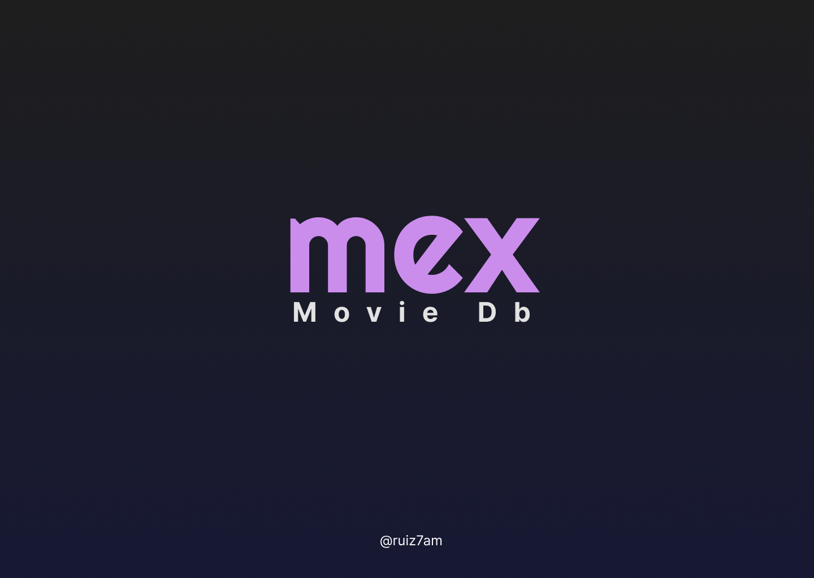

# 🇲🇽 Mex 🎥 Movie DB 🇲🇽

## Overview

Mex Movie Data Base es un sitio creado como práctica para desarrollar las habilidades de frontend developer, utilizando la API de [themoviedb.org](themoviedb.org).

Con este proyecto se están utilizando habilidades obtenidas después de 6 meses de estudiar, practicar e interiorizar en la estructura fundamental en la que se construye la web. Se estarán utilizando habilidades, conceptos y arquitecturas fundamentales para desarrollar sitios y aplicaciones web, desde el diseño UI/UX a traves del diseño y prototipado con herramientas digitales tales como Figma, y la posterior conversión de estos diseños y prototipos en el código HTML, CSS y JavaScript; hasta la creación de componentes mediante la estructura de los Web Components, single page website/webapp y consumo de APIs mediante API REST.

### Diseño de Figma

En proceso, estoy creando los _foundations_ y componentes, aún necesito mejorar mis habilidades con Figma.

;
;

### Tecnologías

- No Frameworks
- Vanilla Code (HTML, CSS, JavaScript)
- Web Components

## Descripción
